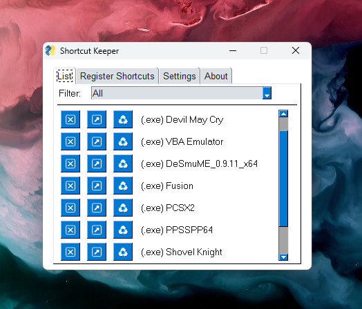

# Shortcut Keeper (v0.1)
An icon grouper applet for windows, inspired by icon grouping feature in KDE plasma and android desktops.

This is just like the icon grouping found in android and KDE plasma desktops.

## Dependencies
It only uses PySimpleGUI. The version I used was `4.60.5`, but it should work on higher versions than that.

The python version I used was `3.11`.

## Installation
1. Create your virtual environment (_doesn't matter what you choose_) and run

```bash
pip3 install pysimplegui
```
**NOTE:** I have included a `Pipfile` in case you want to use `pipenv`.

2. Run the `main.py` file

```bash
python3 ./main.py
```

## Build

I used `pysimplegui-exemaker` to make the script an executable. You can look the details [here](https://pypi.org/project/pysimplegui-exemaker/)

1. install it with the following command

```bash
pip install pysimplegui-exemaker
```

2. run the following to view the GUI of `exe-maker`

```bash
python -m pysimplegui-exemaker.pysimplegui-exemaker
```

3. Enter the python **source file path** which in this case is `./main.py`, and the **icon path**, which is `./edit.ico` (you can change this with any `.ico` file of your choice).

4. Hit `Make EXE` button and an executable should be created.

## Preview



## Features

- Create or delete shortcuts
- Change Color Theme
- Change App name

## Further Development (v0.2)

- [ ] collect more file info
- [ ] enable file categories and filter display
- [ ] enable adding more categories
- [ ] enable deleting categories
- [ ] desktop tray icon
- [ ] enable naming added files
- [ ] enable updating file details
- [ ] enable custom themes
